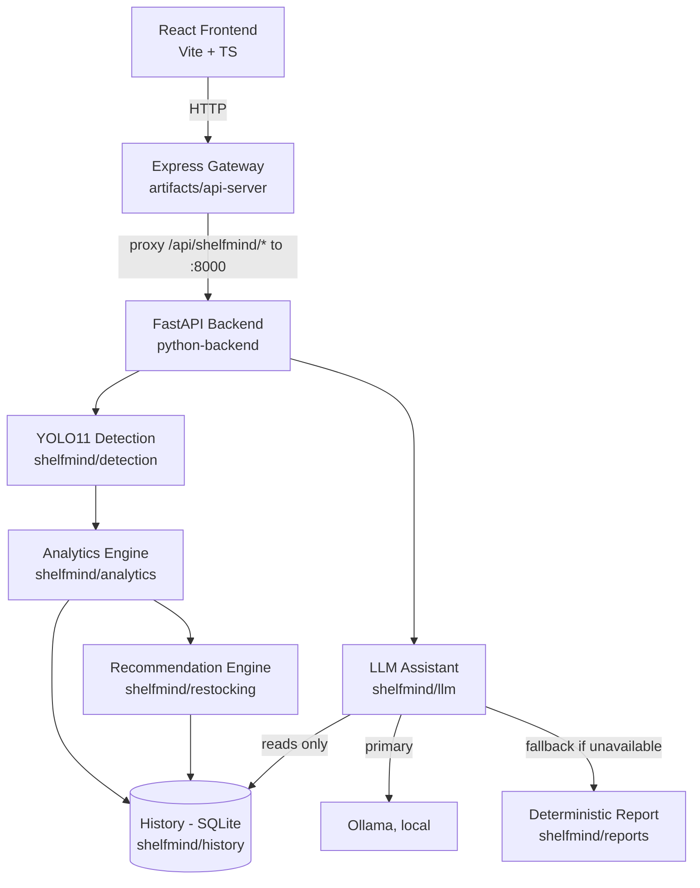
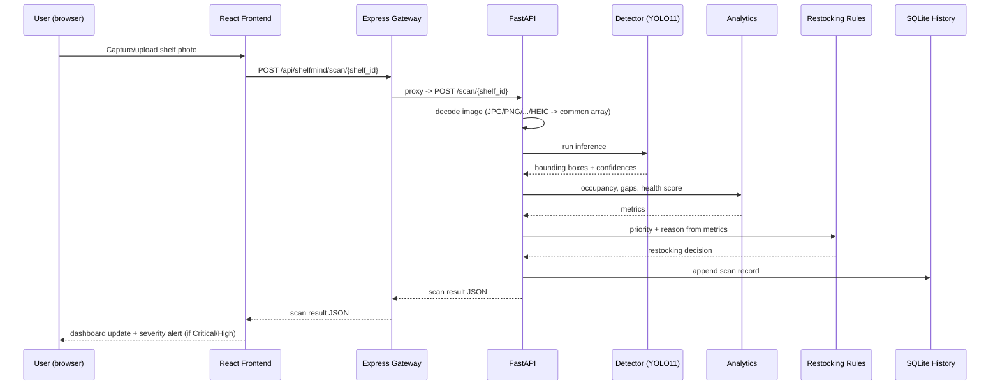

# ShelfMind

Computer-vision-powered retail shelf monitoring: point a camera at a shelf,
get back item counts, occupancy, gap analysis, a health score, a
restocking priority, and a natural-language answer to questions like
*"which shelf needs a refill first?"*

## Table of Contents

- [Overview](#overview)
- [Motivation & Problem Statement](#motivation--problem-statement)
- [Key Features](#key-features)
- [Tech Stack](#tech-stack)
- [Architecture](#architecture)
- [Folder Structure](#folder-structure)
- [Detection Pipeline](#detection-pipeline)
- [Analytics Pipeline](#analytics-pipeline)
- [Recommendation Engine](#recommendation-engine)
- [History](#history)
- [Store Reports & Period Comparisons](#store-reports--period-comparisons)
- [AI Assistant](#ai-assistant)
- [API Overview](#api-overview)
- [Observability](#observability)
- [Installation](#installation)
- [Running the Project](#running-the-project)
- [Sample Test Images](#sample-test-images)
- [Environment Variables](#environment-variables)
- [Model Training](#model-training)
- [Model Evaluation](#model-evaluation)
- [Performance](#performance)
- [Authentication](#authentication)
- [Docker & CI](#docker--ci)
- [Screenshots](#screenshots)
- [Future Improvements](#future-improvements)
- [License](#license)

## Overview

ShelfMind turns a single shelf photo into an actionable retail-ops report.
A YOLO11 model trained on [SKU-110K](https://www.kaggle.com/datasets/thedatasith/sku110k-annotations)
detects individual products; a
deterministic analytics layer converts those detections into occupancy,
gaps, and a health score; a rules engine turns that into a restocking
priority; and an optional local LLM (Ollama) answers free-text questions
grounded strictly in that computed data -- never in raw pixels, and never
in numbers it invented itself.

## Motivation & Problem Statement

Manual shelf audits (a person walking the floor with a clipboard) don't
scale, and don't get anyone useful signal until it's already too late --
a shelf that hit zero stock an hour ago has already cost the store sales.
ShelfMind's premise: a photo taken in seconds gives you the same "is this
shelf in trouble" answer a human auditor would, faster and more
consistently, and turns it into a priority-ranked to-do list instead of
just a photo.

## Key Features

- **Object detection** on real shelf photos via a YOLO11 model fine-tuned
  on SKU-110K (dense retail-shelf imagery), not a generic COCO model.
- **Deterministic analytics**: occupancy %, empty-space %, gap detection,
  and a 0-100 health score -- every number traceable to a formula, not a
  model's guess.
- **Restocking priority** (Critical / High / Medium / Low) from an
  explicit rules engine, with a stated reason per shelf.
- **Scan history** -- every scan is appended and queryable per shelf, so
  trends over time (not just a single snapshot) are available.
- **AI Assistant** -- ask questions in plain English; answers are
  generated only from the same structured JSON the analytics engine
  produces, with a deterministic rule-based fallback if the LLM is
  unavailable, so the feature degrades gracefully instead of failing.
- **Universal image input** -- JPG/PNG/WEBP/BMP/JFIF plus HEIC/HEIF (the
  default iPhone camera format), decoded through one unified path.
- **Camera capture in-browser** (desktop/Android/iPhone) as an
  alternative to file upload.
- **Store Report with period comparisons** -- beyond a single running
  total, the Store Report page lets you compare a store against
  *itself* across time: every day of the current week against each
  other, every week of the current month, every month of the current
  year, and the last 10 calendar years -- each with a units-sold chart,
  a plain-language summary, and a per-period breakdown (top-selling
  shelf, avg health/occupancy, alerts, % change vs. the previous
  period). Downloadable as a self-contained HTML report.
- **Multi-store comparison** -- side-by-side analytics across every
  store on the account, with the same month/year drill-down comparison
  available per store.

## Tech Stack

| Layer | Technology |
|---|---|
| Frontend | React + Vite, TypeScript, Tailwind |
| API Gateway | Express (Node/TypeScript), `http-proxy-middleware` |
| Backend | FastAPI (Python 3.11+) |
| Detection | Ultralytics YOLO11, OpenCV, Pillow + pillow-heif |
| Analytics / Recommendation | Pure Python, deterministic (no ML) |
| History | SQLite (Repository pattern -- swappable for Postgres) |
| AI Assistant | LangChain + Ollama (local LLM), deterministic fallback |
| API types | OpenAPI spec -> orval-generated TS client (`lib/api-client-react`) |
| Package management | pnpm workspaces (JS), uv/pip (Python) |

## Architecture



### Scan request flow



## Folder Structure

```
ShelfMind-AI/
+-- artifacts/
|   +-- shelfmind/           # React frontend (Vite)
|   |   +-- src/{pages,components,hooks,lib}
|   +-- api-server/          # Express gateway (proxies to FastAPI)
+-- python-backend/
|   +-- main.py              # FastAPI app + all routes
|   +-- evaluate_model.py    # Model evaluation pipeline (headline metrics)
|   +-- error_analysis.py    # Failure-mode breakdown by object size
|   +-- eval_results/        # Outputs of both scripts above (checked in)
|   +-- requirements.txt
|   +-- .env.example         # copy -> .env for persistent local config
|   +-- shelfmind/
|       +-- config.py        # all tunables in one place, documented
|       +-- detection/       # YOLO11 wrapper, image decoding
|       +-- analytics/       # occupancy, gaps, health score, comparison
|       +-- restocking/      # rules engine -> priority + reason
|       +-- history/         # SQLite repository pattern
|       +-- alerts/          # severity alert construction
|       +-- llm/             # context builder + chat assistant
|       +-- reports/         # deterministic fallback report generator
|       +-- utils/           # logging, exceptions
|       +-- tests/
+-- lib/
|   +-- api-spec/            # openapi.yaml (source of truth)
|   +-- api-client-react/    # orval-generated TS client (generated/)
|   +-- api-zod/             # generated Zod schemas
|   +-- db/                  # shared schema definitions
+-- README.md
```

## Detection Pipeline

1. **Decode** -- any of JPG/PNG/WEBP/BMP/JFIF is decoded via OpenCV;
   HEIC/HEIF (iPhone default) is decoded via Pillow + pillow-heif and
   converted to the same array shape/dtype OpenCV would produce, so
   everything downstream sees one consistent format regardless of
   source device.
2. **Infer** -- a YOLO11 model (`ultralytics`) fine-tuned on SKU-110K
   detects individual products and returns bounding boxes + confidence
   scores. Confidence threshold is a documented, centralized constant in
   `shelfmind/config.py` (currently `0.20`), not scattered magic numbers.
3. **Shelf assignment / occupancy mask** -- detections are mapped onto
   the shelf region to build an occupancy mask distinguishing filled vs.
   empty shelf area.

## Analytics Pipeline

All of the following are **deterministic formulas**, not model output --
this is intentional (see `shelfmind/config.py` docstrings for the
reasoning behind each threshold):

- **Occupancy %** -- filled shelf area divided by total shelf area.
- **Empty-space %** -- `100 - occupancy_pct` (always consistent by
  construction, not computed independently).
- **Gap analysis** -- contiguous empty regions above a size threshold,
  reported as gap count + largest gap ratio.
- **Health score (0-100)** -- a weighted combination of occupancy, gap
  severity, and detection confidence.
- **Historical comparison** -- latest scan vs. a baseline scan for the
  same shelf (detection count delta, occupancy delta, etc.).

## Recommendation Engine

A rules engine (`shelfmind/restocking/rules_engine.py`) maps the
analytics output to a restocking priority -- **Critical / High / Medium /
Low** -- with an explicit, human-readable reason string per shelf. This
is plain `if/elif` logic against named thresholds, not a model, so every
priority assigned is auditable and reproducible.

## History

Every completed scan is appended to SQLite via a Repository pattern
(`shelfmind/history/repository.py` over `shelfmind/history/db.py`) --
swapping SQLite for Postgres later means writing one new repository
implementing the same interface, with no changes needed above that
layer. The dashboard always reflects the latest scan per shelf; the
history page lists every scan ever recorded for a shelf.

## Store Reports & Period Comparisons

The Store Report page (`/report/full`) gives a running summary --
today / last 30 days / last 12 weeks / last 12 months / last 10 years of
estimated units sold, plus a per-shelf performance table -- built from
the same restock-cycle sales estimator used everywhere else in the app
(`shelfmind/analytics/sales_estimation.py`).

On top of that running total, the same page offers a **self-comparison
view** so you can see how one period stacks up against its neighbors,
not just against the all-time trend line:

| Tab | Compares |
|---|---|
| Weekly | the 7 days of the current week against each other |
| Monthly | the weeks of the current month against each other |
| Yearly -- by month | the 12 months of the current year against each other |
| Yearly -- past 10 years | the last 10 calendar years (incl. the current one) against each other |

Each comparison is served by `/report/compare?scope=week\|month\|year\|decade`
(`ShelfMindService.store_period_comparison`), which reuses the same
per-period breakdown logic (`store_period_breakdown`) that already backs
the cross-store comparison drill-down -- so a "top-selling shelf in
March" number means exactly the same thing whether you're comparing
March against other months at one store, or against another store.
Periods with no scans yet (e.g. a week that just started) are excluded
from "best/worst" comparisons instead of being counted as a decline to
zero.

The full report -- including the executive summary, all trend history,
and the shelf performance table -- can also be downloaded as a single
self-contained HTML file via `/report/download`, with no server-side PDF
dependency required.

## AI Assistant

The assistant answers questions (*"which shelf needs a refill?"*,
*"compare shelf 3 and shelf 8"*, *"daily summary"*) using **only** a
structured JSON context built from stored scan data
(`shelfmind/llm/context_builder.py`) -- it never sees raw images and
never computes its own metrics. The context includes a field glossary so
the model reads counts (`detection_count`) directly instead of trying to
derive them from unrelated percentage fields.

- **Primary provider**: local Ollama (no API key, no cloud dependency).
- **Fallback**: if Ollama isn't reachable, a deterministic rule-based
  summary (`shelfmind/reports`) is returned instead of an error, so the
  feature degrades gracefully rather than breaking the page.
- Model is configured once via `python-backend/.env`
  (`SHELFMIND_OLLAMA_MODEL`) -- no need to re-export an env var every
  session.

> **Current limitation:** only Ollama is wired up as an LLM provider
> today. Multi-provider support (Anthropic/OpenAI as alternatives) is a
> planned, not yet implemented, improvement -- see
> [Future Improvements](#future-improvements).

## API Overview

All routes are served by FastAPI (`python-backend/main.py`) and proxied
through the Express gateway at `/api/shelfmind/*`:

| Method | Path | Purpose |
|---|---|---|
| GET | `/health` | Liveness + readiness (kept for backward compatibility) |
| GET | `/health/live` | Liveness only -- no downstream checks |
| GET | `/health/ready` | Readiness -- checks DB connectivity + model config |
| GET | `/dashboard` | Latest-scan summary across all shelves |
| GET | `/shelves` | List all known shelves |
| GET | `/shelves/{shelf_id}/scans` | Scan history for one shelf (paginated: `?limit=&offset=`, `X-Limit`/`X-Offset`/`X-Has-More` response headers) |
| GET | `/shelves/{shelf_id}/compare` | Latest scan vs. a baseline scan |
| POST | `/scan/{shelf_id}` | Submit an image, run full pipeline |
| GET | `/alerts` | Current Critical/High shelves |
| GET | `/report` | Deterministic store-wide report |
| GET | `/report/full` | Structured report: today / 30-day / 12-week / 12-month / 10-year units-sold history + shelf performance table |
| GET | `/report/compare` | Same-store period comparison (`?scope=week\|month\|year\|decade`) -- day-vs-day, week-vs-week, month-vs-month, or year-vs-year |
| GET | `/report/download` | The full report rendered as a downloadable, self-contained HTML file |
| GET | `/stores/compare` | Side-by-side analytics across every store on the account |
| GET | `/stores/compare/period` | Cross-store drill-down for one specific month/year (`?granularity=month\|year&period_key=...`) |
| POST | `/assistant` | Natural-language Q&A |
| POST | `/auth/forgot-password` | Request a password-reset email (rate-limited) |
| POST | `/auth/reset-password` | Consume a one-time reset token, set a new password |

Every response carries an `X-Request-ID` header (generated per-request, or
echoed back if the caller/gateway already set one) so a single request's
log lines across the stack can be isolated with one grep instead of
matching by timestamp -- see `shelfmind/middleware.py`.

`/auth/login` and `/auth/signup` are rate-limited (5 attempts/minute per
client IP) to prevent unlimited password-guessing against a known
username -- see `shelfmind/auth/rate_limit.py` for the implementation and
its documented single-instance limitation.

The source of truth for request/response shapes is
`lib/api-spec/openapi.yaml`, from which the frontend's typed client
(`lib/api-client-react`) is generated via orval -- the frontend never
hand-writes fetch calls against these routes.

## Observability

- **Request correlation**: every request gets an `X-Request-ID` (new one
  generated, or the caller's own reused), threaded through a `ContextVar`
  so every log line emitted while handling that request includes it
  (`req=<id>` in the log format) without passing it through every function
  signature. Failing requests can be isolated with
  `grep req=<id> shelfmind.log` instead of matching by rough timestamp.
- **Liveness vs. readiness**: `/health/live` never touches a dependency
  (a database blip shouldn't get a healthy process killed by an
  orchestrator); `/health/ready` checks the SQLite connection and whether
  a detection model is configured, so a load balancer can pull an
  instance out of rotation before it serves a failing request instead of
  after.
- **Deliberately not added**: distributed tracing (OpenTelemetry) and
  metrics scraping (Prometheus). Both are real, standard tools -- but for
  a two-hop system (gateway -> FastAPI) with no multi-instance deployment
  today, they'd be infrastructure with no one to look at the dashboards
  they'd produce. A request ID is the minimum version of the same idea
  (answering "which log lines belong to this request") without an
  unused collector/exporter/backend stack. Documented under
  [Future Improvements](#future-improvements) as the natural next step
  once there's more than one instance running.

## Installation

Prerequisites: Node >= 22, pnpm >= 10, Python >= 3.11, and
[Ollama](https://ollama.com/download) if you want the AI Assistant to use
a real model instead of the deterministic fallback.

```bash
# JS workspace
pnpm install

# Python backend
cd python-backend
python -m venv .venv
# Windows: .venv\Scripts\Activate.ps1   |   macOS/Linux: source .venv/bin/activate
pip install -r requirements.txt

# One-time: make local config (e.g. Ollama model) persistent
copy .env.example .env   # Windows
cp .env.example .env     # macOS/Linux
```

You'll also need a trained detection model at
`python-backend/models/best.pt` (or set `SHELFMIND_MODEL_PATH`) -- this
repo doesn't ship model weights or datasets.

## Running the Project

Three processes, three terminals:

```bash
# 1) Frontend (Vite dev server)
cd artifacts/shelfmind
pnpm dev

# 2) Express gateway
cd artifacts/api-server
pnpm dev

# 3) Python backend
cd python-backend
uv run python main.py
```

If using the AI Assistant with Ollama, make sure `ollama serve` is
running and the model in your `.env` is pulled
(`ollama pull llama3.2:3b`, or whichever model you've configured).

## Sample Test Images

Since this project isn't hosted anywhere, anyone trying it out (e.g. a
recruiter) needs a few real shelf photos on hand to actually exercise the
scan flow. The [`sample-images/`](sample-images/) folder holds a handful
for exactly that -- upload one from the New Scan page and go.

If that folder is empty or you want more, they're a few random images
from the validation split of the same dataset the detection model was
fine-tuned on: **[SKU-110K on Kaggle](https://www.kaggle.com/datasets/thedatasith/sku110k-annotations)**.
Pull a small sample with a Kaggle notebook (no local download of the
full ~13GB dataset required):

1. Create a new Kaggle Notebook.
2. In the right sidebar, **Add Input** -> search `sku110k-annotations`
   (by `thedatasith`) -> add it.
3. Run this cell:

```python
import random, shutil, zipfile
from pathlib import Path

# Newer Kaggle notebook environments mount added datasets one level
# deeper, under /kaggle/input/datasets/<owner>/<slug>/ instead of the
# classic /kaggle/input/<slug>/. This searches for the images regardless
# of which layout you get, so it works either way.
images = sorted(p for p in Path("/kaggle/input").rglob("*.jpg") if "val" in p.parts)
print(f"Found {len(images)} jpg files under /kaggle/input")
if not images:
    raise SystemExit(
        "No .jpg files found -- check the dataset shows as attached in "
        "the 'Add Input' sidebar before re-running."
    )

OUT = Path("/kaggle/working/shelfmind-sample-images")
OUT.mkdir(exist_ok=True)

random.seed(42)
n = min(15, len(images))  # tweak the count as needed
sample = random.sample(images, n)

for img in sample:
    shutil.copy(img, OUT / img.name)

zip_path = "/kaggle/working/shelfmind-sample-images.zip"
with zipfile.ZipFile(zip_path, "w") as zf:
    for img in OUT.glob("*.jpg"):
        zf.write(img, img.name)

print(f"Zipped {len(sample)} images to {zip_path}")
```

4. Download `shelfmind-sample-images.zip` from the notebook's Output pane.
5. Unzip it into `sample-images/` at the repo root (i.e. the `.jpg` files
   go directly in that folder, alongside its `README.md`).

The `val` split is used deliberately -- it's held out from training, so
it's a fair, representative sample rather than images the model has
already seen.

## Environment Variables

Set once in `python-backend/.env` (see `.env.example` for the full list):

| Variable | Purpose | Default |
|---|---|---|
| `SHELFMIND_OLLAMA_MODEL` | Local model used by the AI Assistant | `llama3.1` |
| `SHELFMIND_OLLAMA_URL` | Ollama server address | `http://localhost:11434` |
| `SHELFMIND_OLLAMA_TIMEOUT_SECONDS` | Request timeout to Ollama | `90` |
| `SHELFMIND_MODEL_PATH` | Path to trained YOLO weights | `models/best.pt` |
| `SHELFMIND_CONFIDENCE_THRESHOLD` | Detection confidence cutoff | `0.20` |
| `SHELFMIND_PORT` | FastAPI port | `8000` |
| `SHELFMIND_SMTP_HOST/USERNAME/PASSWORD/FROM_EMAIL` | SMTP creds for password-reset emails | unset -- logs instead of sending (see [Password Reset](#password-reset)) |
| `SHELFMIND_FRONTEND_URL` | Base URL embedded in reset-password links | `http://localhost:5173` |

## Authentication

ShelfMind is multi-store: every account signs up under a **store name**,
and that store is a hard data-isolation boundary from then on. A user
only ever sees the shelves, scans, alerts, and reports created under
their own store -- never another store's data, even via the AI assistant.
Teammates who sign up with the *same* store name join that same store
(so a whole staff can share one store's data); a different store name
creates a brand-new, isolated store.

Every endpoint except `POST /auth/login` and `POST /auth/signup` requires
a JWT bearer token (`SHELFMIND_REQUIRE_AUTH=true` by default -- do not
disable this in any public deployment). The frontend has a full sign
up / log in screen and won't render any store data until the user is
authenticated.

### Password Reset

`/auth/forgot-password` issues a single-use, time-limited reset token and
emails a reset link via SMTP (`shelfmind/utils/email.py`); `/auth/reset-password`
consumes that token and sets the new password. Two design choices worth
calling out:

- **The response never reveals whether the account exists.** Whether or
  not the username/email matches an account, the API returns the same
  "if an account matches, we've sent a link" message -- this prevents the
  endpoint from being usable to enumerate valid accounts/emails.
- **No SMTP configured -> no silent failure and no fake success.** If
  `SHELFMIND_SMTP_HOST/USERNAME/PASSWORD/FROM_EMAIL` aren't set, the email
  is logged instead of sent (`is_configured()` check in
  `shelfmind/utils/email.py`), so the reset flow is still fully testable
  end-to-end in local dev/CI without real credentials, and a misconfigured
  deployment fails loudly in the logs rather than pretending to have sent
  mail. See `.env.example` for the Gmail app-password setup.

Sign up, then use the returned token:

``` bash
TOKEN=$(curl -s -X POST http://localhost:8000/auth/signup \
  -H "Content-Type: application/json" \
  -d '{"username":"alex","password":"a-strong-password","store_name":"Downtown Store 1"}' \
  | python3 -c "import sys,json;print(json.load(sys.stdin)['access_token'])")

curl -X POST http://localhost:8000/scan/shelf-1 \
  -H "Authorization: Bearer $TOKEN" \
  -F "image=@/path/to/shelf.jpg"
```

Or log in with an existing account:

``` bash
curl -X POST http://localhost:8000/auth/login \
  -H "Content-Type: application/json" \
  -d '{"username":"alex","password":"a-strong-password"}'
```

A legacy single shared "staff" account (under a "Default Store") is still
seeded from `.env` for local scripting convenience:

``` text
SHELFMIND_STAFF_USERNAME=staff
SHELFMIND_STAFF_PASSWORD=ChangeMe123!
```

**Change/remove this before deploying anywhere public** -- real
deployments should have every staff member sign up under their own store
instead. Auth can be disabled entirely for local scripting via
`SHELFMIND_REQUIRE_AUTH=false` -- do not do this in any public deployment,
since it also disables per-store data isolation. Passwords are
bcrypt-hashed; tokens are HS256 JWTs (embedding `store_id`) with a
120-minute default expiry (`SHELFMIND_TOKEN_EXPIRE_MINUTES`).

## Docker & CI

Each service has its own Dockerfile (monorepo-aware -- they build from the
repo root so pnpm workspace packages resolve correctly):

``` bash
docker compose up --build
```

This starts the FastAPI backend (`:8000`), the Express gateway (`:3000`),
and the built frontend served via nginx (`:5173`). Trained model weights
are mounted at runtime (`python-backend/models/`), not baked into the
image -- see [Known Limitations](#known-limitations)-equivalent note in
`python-backend/Dockerfile`.

`.github/workflows/ci.yml` runs the Python test suite with coverage on
every push/PR, plus a workspace-wide `pnpm typecheck` and `pnpm build`.

## Model Training

`python-backend/training/train_yolo11_sku110k.ipynb` is the actual
notebook used to produce `best.pt` -- run on Kaggle against a T4 GPU.
It's included (with its original outputs -- training curves, confusion
matrix, PR curve, and qualitative prediction grids still attached) so
the model isn't a black box: anyone can see exactly how it was trained
and reproduce it.

What it does, end to end:

1. Installs Ultralytics and confirms a GPU is available.
2. Auto-detects whatever SKU-110K variant you attached as a Kaggle
   Input -- native CSV, YOLO txt, Pascal VOC XML, COCO JSON, or an
   already-YOLO-formatted mirror -- and converts it to a standard
   `images/{train,val,test}` + `labels/{train,val,test}` layout,
   carving out a val split automatically if the source only has train/test.
3. Fine-tunes a pretrained `yolo11s.pt` checkpoint on the converted
   dataset (single class -- `object` -- since SKU-110K doesn't label
   individual SKUs, just "a product is here"). Augmentation is
   deliberately tuned for shelf photos: no rotation or vertical flip
   (shelves are always shot upright), mild hue/saturation/brightness
   jitter (lighting varies store to store), and mosaic for small,
   densely packed objects.
4. Validates the trained weights, saves training curves + confusion
   matrix + PR/F1 curves, and renders a qualitative prediction grid on
   held-out val images so you can eyeball detection quality directly.
5. Packages `best.pt` plus the evaluation plots into a downloadable zip.

To retrain or fine-tune further: open the notebook on Kaggle, attach an
SKU-110K dataset as Input (see [Sample Test Images](#sample-test-images)
for one that works), enable a GPU accelerator, and run all cells. Drop
the resulting `best.pt` into `python-backend/models/`.

## Model Evaluation

`python-backend/evaluate_model.py` evaluates an already-trained `best.pt`
against a held-out SKU-110K validation split -- it does **not** retrain
anything. It wraps Ultralytics' own validator (so mAP numbers are
comparable to published SKU-110K benchmarks) and adds: a
confidence-threshold sweep, a wall-clock inference-speed benchmark on
your machine, and a sample-prediction grid.

```bash
python evaluate_model.py \
  --data /path/to/sku110k.yaml \
  --weights models/best.pt \
  --out-dir eval_results \
  --thresholds 0.1 0.2 0.25 0.35 0.5 0.6 \
  --device cpu \
  --num-samples 12
```

Outputs (written to `--out-dir`): Precision, Recall, F1, mAP50, mAP50-95,
a confusion matrix, a PR curve, the threshold sweep table, inference
speed/FPS, and sample prediction images.

> **Note:** the dataset itself (SKU-110K) and trained weights are
> intentionally not part of this repo -- point `--data`/`--weights` at
> your own local copies.

## Performance

Evaluated with `evaluate_model.py` against the production model
(`best.pt`, YOLO11s, 9.4M params) on the SKU-110K validation split
(584 images, 90,456 labeled instances), on an NVIDIA T4 GPU.

### Headline metrics (confidence = 0.20, the deployed threshold)

| Metric      | Value  |
|-------------|--------|
| Precision   | 0.909  |
| Recall      | 0.843  |
| F1          | 0.875  |
| mAP50       | 0.888  |
| mAP50-95    | 0.556  |

### Inference speed

| Stat   | Value               |
|--------|---------------------|
| Mean   | 10.9 ms (91.75 FPS) |
| P95    | 11.13 ms            |

Measured over 50 forward passes at 640px input.

### Why confidence = 0.20

A sweep across seven thresholds (0.10-0.75) shows F1 is essentially flat
through 0.10-0.25 (0.884-0.885) and only starts trading recall for
precision meaningfully past 0.35. Past 0.50 the drop is steep -- at 0.75,
precision reaches 0.99 but recall collapses to 0.43, meaning the model
would miss well over half of all products on a shelf. For a shelf
monitoring use case, under-counting empty space is the costlier failure
mode, so the deployed threshold (0.20) sits inside the flat, high-recall
plateau rather than chasing a marginal F1 gain at 0.10 that offers no
real benefit.

| Confidence | Precision | Recall | F1     | mAP50  |
|------------|-----------|--------|--------|--------|
| 0.10       | 0.908     | 0.863  | 0.885  | 0.885  |
| 0.20       | 0.908     | 0.863  | 0.885  | 0.868  |
| 0.25       | 0.906     | 0.864  | 0.885  | 0.859  |
| 0.35       | 0.923     | 0.847  | 0.883  | 0.832  |
| 0.50       | 0.954     | 0.789  | 0.863  | 0.776  |
| 0.60       | 0.970     | 0.728  | 0.832  | 0.718  |
| 0.75       | 0.992     | 0.429  | 0.599  | 0.423  |

Full report, confidence-sweep data, confusion matrix, and PR curve:
[`eval_results/`](eval_results/) -- see `metrics_report.md`,
`summary.json`, `confidence_sweep.csv`, and
`confusion_matrix.png` / `BoxPR_curve.png`.

> **Reading the confusion matrix correctly:** the raw object/background
> counts in `confusion_matrix.png` don't arithmetically reconcile with
> the headline precision/recall above -- this is expected, not a bug.
> Ultralytics computes the confusion matrix via fixed-threshold greedy
> matching and the headline P/R/mAP via full PR-curve integration; they're
> different code paths by design
> ([ultralytics/ultralytics#21626](https://github.com/ultralytics/ultralytics/issues/21626)).

### Failure-mode analysis (where the model actually fails)

A single mAP number hides *where* a detector fails. `error_analysis.py`
answers that directly: it buckets every ground-truth box and prediction
by **relative size** (box area / image area, using this validation set's
own 33rd/67th-percentile tercile boundaries -- not fixed COCO pixel
cutoffs, since those assume COCO-scale images and shelf photos aren't
COCO-scale), then reports recall/precision per bucket and saves the
worst-performing images, annotated.

```bash
python error_analysis.py --data /path/to/sku110k.yaml --weights models/best.pt
```

| Size (rel. area) | Recall | Precision |
|---|---|---|
| small (< 0.16%) | 0.723 | 0.712 |
| medium (0.16-0.30%) | 0.950 | 0.873 |
| large (> 0.30%) | 0.971 | 0.906 |

Both recall and precision drop by ~20+ points in the small bucket
relative to medium/large -- consistent with the mAP50 vs. mAP50-95 gap
above (tight localization degrades faster than loose overlap on small
boxes). Inspecting the annotated worst-case images
([`eval_results/worst_images/`](eval_results/worst_images/)) surfaces two
*distinct* failure patterns, not one:

1. **Dense, repeated case-stacks** (promotional pyramid displays of
   identical cartons) -- near-total misses even on large, well-lit boxes,
   pointing at NMS suppression on near-duplicate adjacent detections
   rather than a resolution problem.
2. **Genuinely small, tightly-packed items** (e.g. tealight candles) --
   the classic small-object detection failure, consistent with the
   size-bucket table above.

These are different problems with different fixes (NMS/IoU tuning for
(1), tiled/sliced inference such as SAHI for (2)) -- documented here
rather than solved, since testing either requires a retrain/reconfigure
cycle beyond this evaluation pass. See
[Future Improvements](#future-improvements).

## Screenshots

<!-- Add real screenshots before publishing -- placeholders below. -->

| Dashboard | New Scan | AI Assistant |
|---|---|---|
| `docs/screenshots/dashboard.png` | `docs/screenshots/new-scan.png` | `docs/screenshots/assistant.png` |

## Future Improvements

- **Address the two failure modes found in
  [error analysis](#failure-mode-analysis-where-the-model-actually-fails)**:
  tune NMS/IoU thresholds specifically against the dense-stacked-display
  images, and evaluate tiled/sliced inference (SAHI) for small,
  tightly-packed items -- then re-run `error_analysis.py` and compare the
  size-bucketed recall/precision to today's baseline.
- Multi-provider LLM support (Anthropic/OpenAI alongside Ollama, with
  automatic provider detection) -- Ollama-only today.
- Expanded backend test coverage for analytics edge cases and the image
  decode pipeline.
- Frontend test coverage (currently typecheck + build only in CI, no
  component/unit tests yet).
- Hosted demo / deployed instance with a walkthrough video or screenshots
  (currently local-only; see [Docker & CI](#docker--ci) for how to run it).

### If this needed to scale (not implemented -- reasoning only)

The items below are a deliberate *non*-implementation. Each is a real,
standard answer to a real scaling problem, but none of them solve a
problem this project actually has today (single store, one process, a
few scans a day). Adding them now would be complexity with nothing to
justify it -- the kind of thing that looks impressive in a README and
falls apart under a "why does this need that?" question in an interview.
Documenting the reasoning here instead of the code:

- **SQLite -> PostgreSQL**: the history layer is already a Repository
  pattern (`shelfmind/history/repository.py`) specifically so this swap
  is one new implementation of the same interface, not a rewrite. The
  trigger for actually doing it: concurrent writes from more than one
  process (SQLite serializes writes file-wide), which starts to matter
  somewhere past a handful of stores scanning simultaneously.
- **Rate limiter -> Redis-backed**: today's in-process sliding-window
  limiter (`shelfmind/auth/rate_limit.py`) only enforces its limit
  per-instance. The trigger: running more than one API instance behind a
  load balancer, at which point a shared `INCR`+`EXPIRE` counter in Redis
  replaces the in-memory dict with the same interface.
- **Synchronous scan processing -> a job queue**: `/scan/{shelf_id}` runs
  detection inline and blocks the HTTP response on it. That's fine at
  10.9ms/inference (see [Performance](#performance)) for one store's
  traffic; it stops being fine once scan volume means requests start
  queueing behind GPU-bound inference. The trigger-based fix is a queue
  (SQS/RabbitMQ) with a separate worker pool consuming it, returning a
  scan ID immediately and letting the client poll or subscribe for the
  result -- not adding this preemptively, since it changes the API
  contract (sync response -> async job) for a problem that doesn't exist
  at current scale.
- **Distributed tracing / metrics (OpenTelemetry, Prometheus)**: see
  [Observability](#observability) above -- deferred for the same reason,
  with the request-ID middleware as the load-bearing minimum version in
  the meantime.

## License

MIT -- see [LICENSE](LICENSE).
